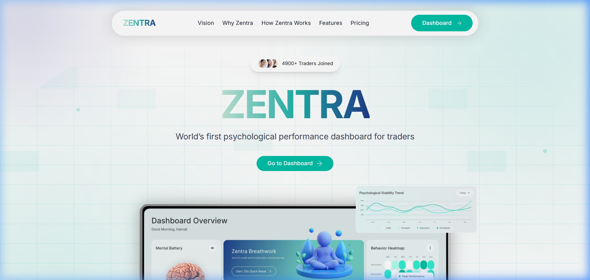
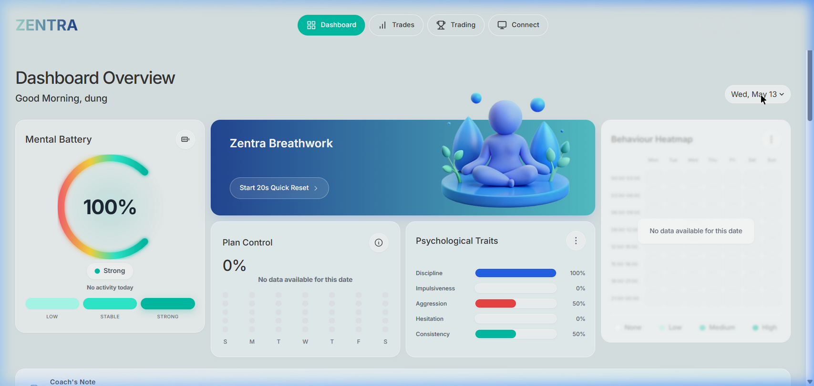
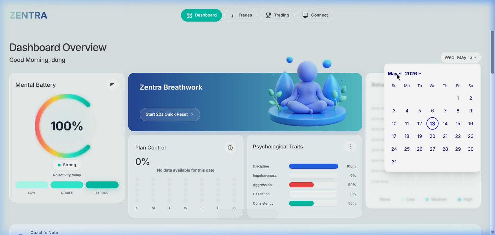
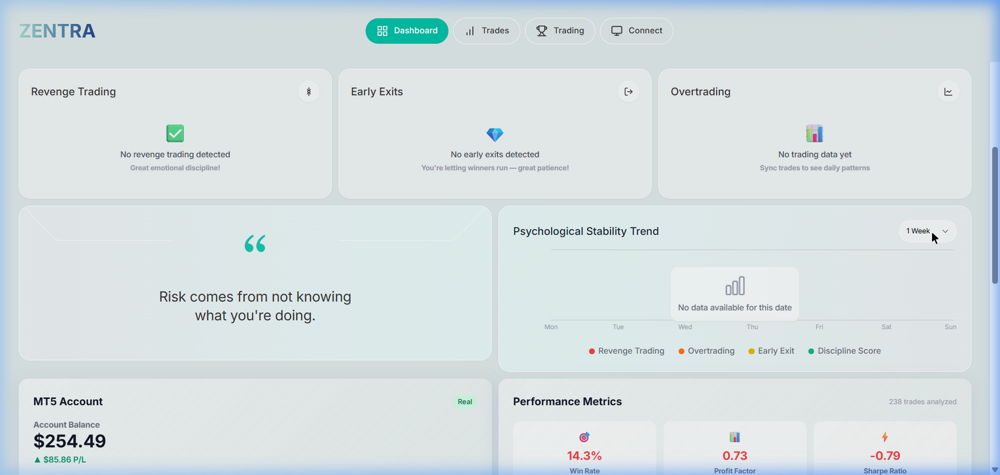
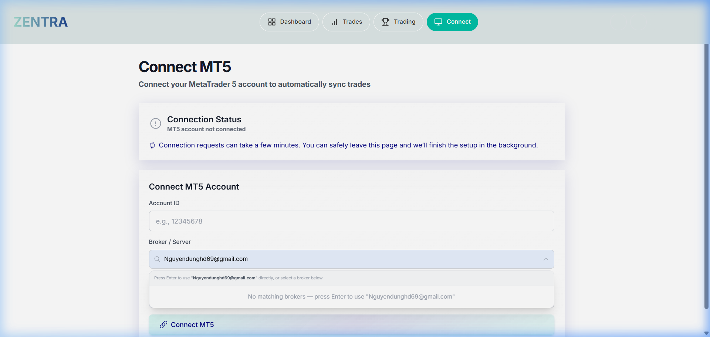
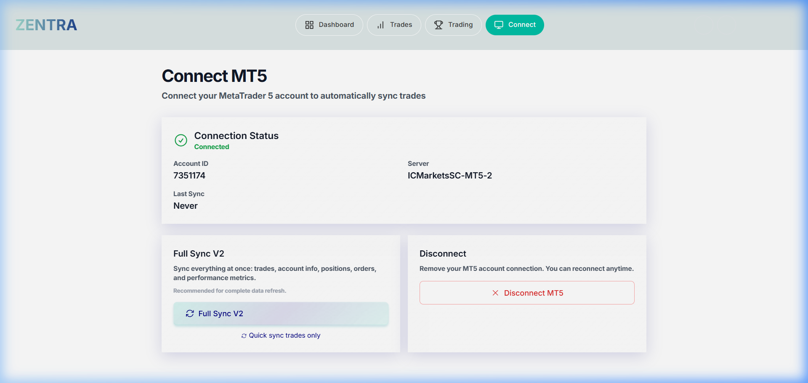
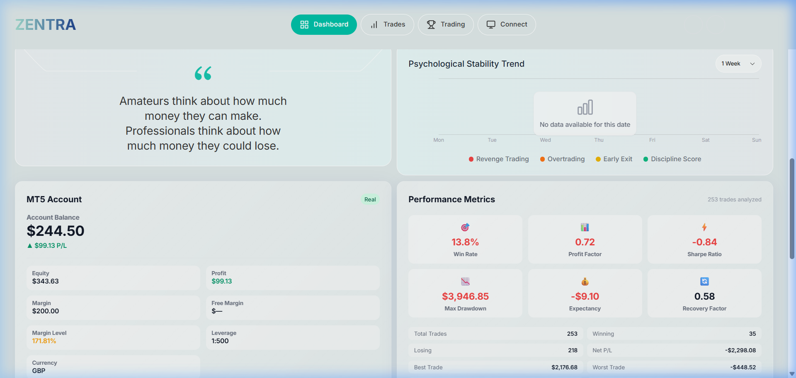
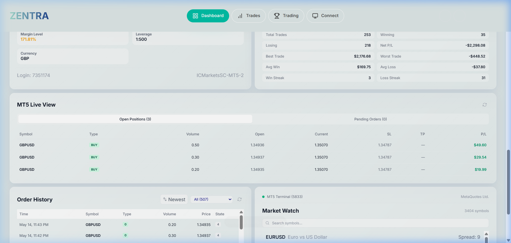
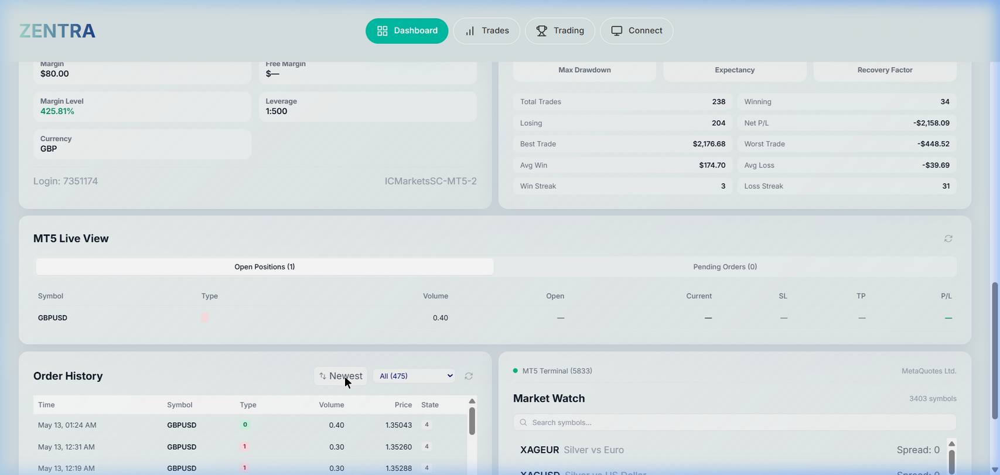
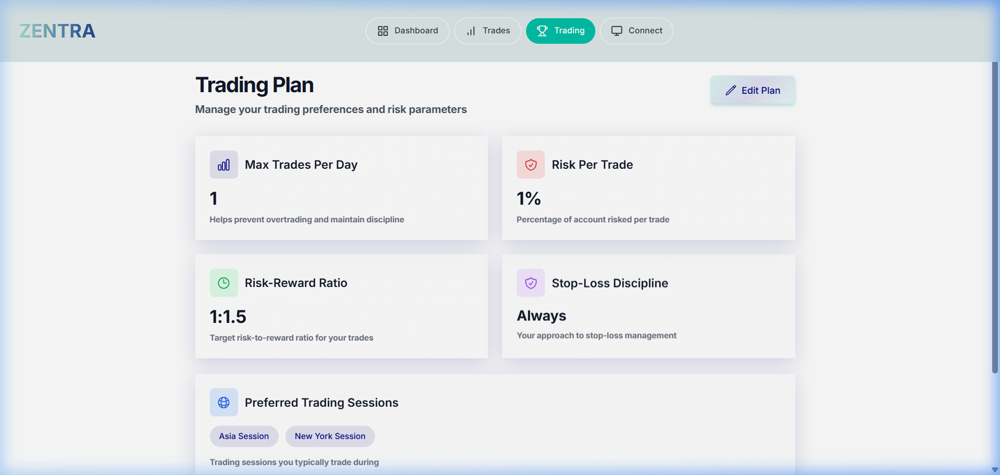

<div align="center">

# 🧠 TradeMind Analytics

### **MT5 Trading Psychology & Behavioral Analytics Platform**

*AI-powered dashboard that transforms your MetaTrader 5 trade history into actionable psychological insights — helping traders master their emotions and maximize performance.*

---



</div>

---

## 🔥 What is TradeMind Analytics?

**TradeMind Analytics** is a full-stack web application designed for **serious traders** who want to understand and improve their trading psychology. It connects directly to your **MetaTrader 5** account, automatically syncs your trade history, and provides real-time behavioral analysis powered by AI.

> *"90% of trading success is psychology. TradeMind gives you the tools to master it."*

### 💡 The Problem
Most traders fail not because of bad strategies, but because of **emotional mistakes** — revenge trading, overtrading, exiting too early, and breaking their own rules. Traditional trading journals don't catch these patterns.

### ✅ The Solution
TradeMind Analytics **automatically detects** behavioral patterns from your trade data and provides:
- Real-time psychological state monitoring
- AI coaching tailored to your specific weaknesses
- Visual analytics that make patterns impossible to ignore

---

## 📸 Platform Screenshots

<div align="center">

### 🏠 Dashboard — Psychology Overview
*Real-time mental health gauge, breathwork exercises, plan compliance, and behavior heatmap*



---

### 📅 Interactive Date Navigation
*Browse your psychological state for any historical date with month/year dropdown*



---

### ⚡ Behavioral Analysis & Stability Trend
*Revenge Trading detection · Early Exit analysis · Overtrading monitoring · Daily quote · Stability chart*



---

### 🔗 One-Click MT5 Connection
*Connect your MetaTrader 5 account in seconds — supports all brokers worldwide*

| Connect Form | Connection Established |
|:---:|:---:|
|  |  |

---

### 💰 MT5 Account & Performance Metrics
*Live balance, equity, margin tracking · Win Rate, Profit Factor, Sharpe Ratio, Max Drawdown*



---

### 📡 Live Positions & Order History
*Real-time open positions · Complete trade log · Newest/Oldest sorting · Symbol filter*

| MT5 Live View | Order History |
|:---:|:---:|
|  |  |

---

### 📋 Trading Plan Builder
*Define your rules, risk parameters, and session preferences — then track compliance automatically*



</div>

---

## 🧠 Core Modules

<table>
<tr>
<td width="50%">

### 🔋 Mental Battery
Real-time psychological energy gauge (0–100%). Beautiful arc gauge visualization with 3 levels: **Low**, **Stable**, **Strong**. Auto-calculated from trade patterns, win/loss streaks, and behavioral signals.

### 🧘 Zentra Breathwork
Guided 20-second breathing exercise with stunning 3D animation. Auto-suggested when mental battery drops below threshold — helping traders reset before making emotional decisions.

### 📋 Plan Control
Trading plan compliance score with weekly bar chart calendar view. Measures how well you follow your own pre-defined rules.

### 💬 AI Coach's Note
GPT-4 powered coaching advice generated from your recent trading behavior. Personalized tips and warnings displayed as a full-width bar.

</td>
<td width="50%">

### ⚡ Revenge Trading Detection
Automatically identifies rapid re-entry after losses — the #1 emotional mistake. Tracks emotional discipline score with real-time alerts.

### 🚪 Early Exit Analysis
Detects when trades are closed too early before hitting targets. Measures patience scoring with improvement suggestions.

### 📊 Overtrading Monitor
Flags excessive trading frequency against your optimal daily count. Prevents burnout and emotional decision-making.

### 📈 Stability Trend
Multi-series line chart tracking consistency over 1 Week / 2 Weeks / 1 Month. Visualizes Revenge, Overtrading, Early Exit, and Discipline trends.

</td>
</tr>
</table>

---

## 🏗️ Architecture Overview

```
┌─────────────────────────────────────────────────┐
│            Frontend (Next.js 14 + React 18)     │
│     Tailwind CSS · Framer Motion · Recharts     │
└──────────────────────┬──────────────────────────┘
                       │ REST API (JWT Auth)
┌──────────────────────▼──────────────────────────┐
│          Backend API (Node.js + Express)         │
│       MongoDB · JWT · OpenAI GPT-4 · Joi        │
└──────────────────────┬──────────────────────────┘
                       │
        ┌──────────────┴──────────────┐
        ▼                             ▼
┌───────────────┐           ┌─────────────────┐
│   MongoDB     │           │  Python Flask    │
│   Atlas DB    │           │  MT5 Bridge      │
│               │           │  (MetaTrader5)   │
└───────────────┘           └─────────────────┘
```

---

## 🛠️ Tech Stack

| Layer | Technology | Purpose |
|-------|-----------|---------|
| 🎨 Frontend | Next.js 14, React 18, Tailwind CSS | Server-side rendering, responsive UI |
| ✨ Animation | Framer Motion, Custom SVG | Smooth transitions, micro-interactions |
| 📊 Charts | Recharts, Custom Arc Gauges | Data visualization, trend charts |
| ⚙️ Backend | Node.js, Express.js, Mongoose | RESTful API, business logic |
| 🗄️ Database | MongoDB Atlas | User data, trades, behavioral analysis |
| 🐍 MT5 Bridge | Python, Flask, MetaTrader5 | Real-time broker connection |
| 🤖 AI Engine | OpenAI GPT-4 | Coach advice, pattern recognition |
| 🔐 Auth | JWT (Access + Refresh) | Secure authentication |

---

## 📡 API Highlights

### Psychology Analytics (V2)
```
GET /v2/mental-battery          → Psychological energy score
GET /v2/plan-control            → Rule compliance percentage
GET /v2/behavior-heatmap        → Weekly behavior calendar
GET /v2/psychological-radar     → 5-axis trait profile
GET /v2/revenge-trading         → Revenge pattern detection
GET /v2/early-exits             → Early exit analysis
GET /v2/overtrading             → Overtrading detection
GET /v2/consistency-trend       → Stability trend data
```

### MT5 Integration (V1)
```
POST /v1/mt5/connect            → Connect MT5 account
GET  /v1/mt5/positions          → Live open positions
GET  /v1/mt5/performance        → Trading performance metrics
POST /v1/mt5/full-sync-v2       → Full data synchronization
GET  /v1/mt5/orders/history     → Complete order history
```

---

## 📄 License

This project is proprietary software. Source code is not included in this repository.

For inquiries, please contact the repository owner.

---

<div align="center">

**Built with ❤️ for traders who take psychology seriously.**

*TradeMind Analytics — Your psychology, your edge.*

</div>
